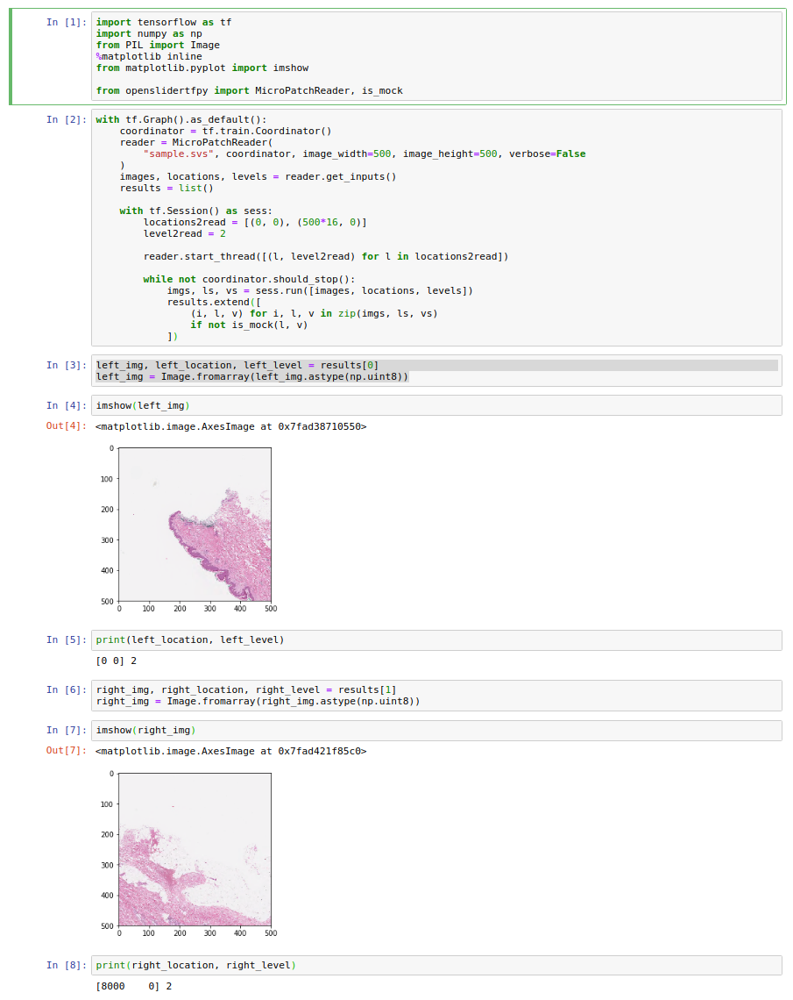
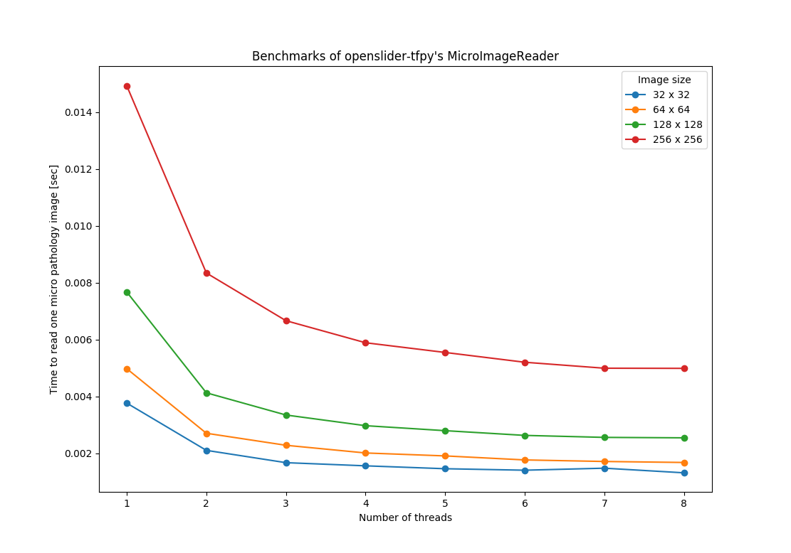

# openslider-tfpy

TensorFlow cunstom runner to read micro images from whole slide images.
This package uses openslide-python(https://openslide.org/api/python/)'s `read_region` function to produce tile images from whole slide images.

By using this library, you can input small patch images to your TensorFlow model. For example, let's suppose you have trained your machine learning model to detect mitotic cells of breast cancer and want to apply the trained model to the entire region of new pathology slides, the following codes would be the solution.


## Usage


~~~python
import tensorflow as tf

from openslidertfpy import MicroPatchReader


openslide_read_region_params = [
    ((100, 100), 0),  # location and level for openslide's read_region func
    ((200, 200), 0),
    ((300, 300), 1)  # And so on...
]
image_width, image_height = 128, 128

with tf.Graph().as_default():
    coordinator = tf.train.Coordinator()
    reader = MicroPatchReader(
        "sample.svs", coordinator, image_width, image_height
    )
    images, locations_batch, levels_batch = reader.get_inputs()
    # Define images, openslide's read_region function parameters

    results = some_op(images)  # Place your ML model here

    with tf.Session() as sess:

        # Some function to initialize values should be placed here

        # Start reading pathology images
        runner.start_thread(openslide_read_region_params)
        while not coordinator.should_stop():
            actual_results, actual_locations, actual_levels = sess.run(
                [results, locations_batch, levels_batch]
            )
~~~



See `examples/read_region.py`.


## Benchmark




## Installation

### Prerequirements

Please install openslide and tensorflow to your system first.

On Ubuntu;

```bash
$ sudo apt install python3-openslide
$ pip install tensorflow  # or tensorflow-gpu
```

### Install

~~~sh
$ python3 -m pip install git+https://github.com/OtaYuji/openslider-tfpy
~~~

Check the installation.

~~~sh
$ python3 -c "import openslidertfpy; print(openslidertfpy.__version__)"
~~~

or you can simple place `openslidertfpy/openslidertfpy.py` file to your working directory.